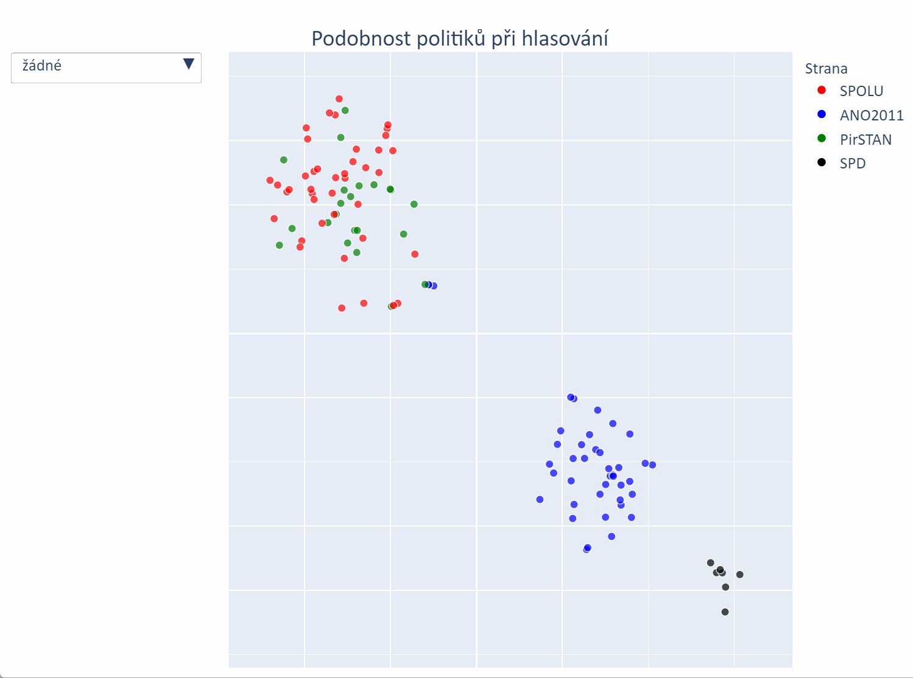

# Podobnost hlasování politikù
-----
### Zadání:

_Použijte otevøená data z Poslanecké snìmovny na adrese [https://www.psp.cz/sqw/hp.sqw?k=1300](https://www.psp.cz/sqw/hp.sqw?k=1300) a získejte seznam poslancù, kteøí jsou aktivní v tomto volebním období. Pro každého z nich pomocí wikipedie, ideálnì pomocí jejich profilu na wikidata zjistìte také jejich povolání. Pokud u nìjakého poslance není možné dohledat jeho odbornost/pøedchozí povolání, vyškrtnìte ho ze seznamu._

_Následnì proveïte analýzu jejich hlasování a zjistìte, jestli shoda v odbornosti/profesi se projevuje také pøi hlasování, nebo jestli je pøi jejich hlasování významnìjší shoda v rámci politické strany. Jinými slovy zjistìte, jestli hlasování politika více ovlivnìné politická pøíslušnost, nebo odbornost._

_Více než kvalita datasetu, nebo zkreslení dané tématem hlasování nás zajímá Váš pøístup k získání dat, jejich propojení a postup vyhodnocení. Výslednou práci nám prosím pošlete dopøedu vèetnì zdrojového kódu a v druhém kole prodiskutujeme k èemu jste došel a jaký postup jste k tomu zvolil._

-----
### Postup:
1. Naètení dat z webových stránek [Poslanecké snìmovny Parlamentu Èeské republiky](https://www.psp.cz/sqw/hp.sqw?k=1300)
2. Naètení údajù o zamìstnání politikù z [wikidata](https://www.wikidata.org/wiki/Wikidata:Main_Page).
3. Transformace údajù o hlasování:
	* použití metody [One-Hot Encoder](https://scikit-learn.org/stable/modules/generated/sklearn.preprocessing.OneHotEncoder.html) pro transformaci pro / proti / zdržel se
	* použití [TruncatedSVD](https://scikit-learn.org/stable/modules/generated/sklearn.decomposition.TruncatedSVD.html) pro první zredukování dimenzionality na 50
	* použití metody [T-distributed Stochastic Neighbor Embedding](https://scikit-learn.org/stable/modules/generated/sklearn.manifold.TSNE.html) pro finální zredukování dimenzionality na 2
4. vizualizace podobnosti
-----
# Ukázka

-----
# TODO

1. Vytvoøit filtr na jednotlivé témata hlasování. Lékaøi mohou hlasovat stejnì jako strana, ve které jsou èleny pro obecná témata, ale pro lékaøská témata mohou hlasovat jednotnì.
2. Proèistit dataset zamìstnání (uèitel, uèitel matematiky, uèitel na vysoké škole, ...)